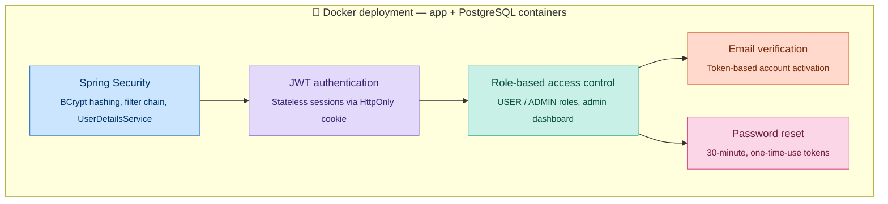
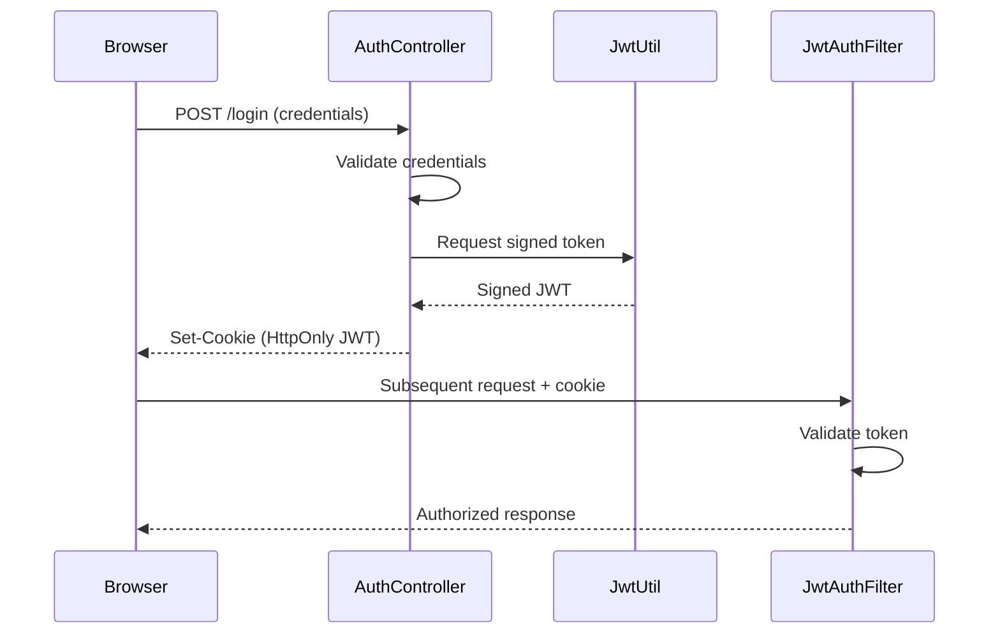

# SecureAuthPortal

A full-featured authentication and authorization system built with Spring Boot — taken step by step from a basic login/register app into a production-style, containerized application.

> Originally built as `SpringBootRegLoginApp`, later renamed to **SecureAuthPortal** as the project matured.

    

---

## ✨ Features

- 🔐 **Spring Security** — full filter chain, BCrypt password hashing, custom `UserDetailsService`
- 🪙 **JWT Authentication** — stateless auth via HttpOnly cookies (no server-side sessions)
- 👥 **Role-Based Access Control (RBAC)** — `USER` / `ADMIN` roles, admin dashboard, promote/demote endpoint
- 📧 **Email Verification** — token-based account verification flow
- 🔑 **Password Reset** — secure, time-limited, one-time-use reset tokens
- 🐳 **Dockerized** — multi-stage build, Docker Compose with app + PostgreSQL

---

## 🏗️ Architecture at a glance

Each stage layers a new capability on top of the last, all running inside a Docker deployment:



## 🔄 Login flow (JWT in an HttpOnly cookie)



The JWT never touches client-side JavaScript or `localStorage` — it lives only in an `HttpOnly` cookie, so it isn't readable by scripts and isn't vulnerable to typical XSS-based token theft.

---

## 🛠️ Tech Stack

| Layer | Technology |
|---|---|
| Backend | Spring Boot 4.0.5, Java 17 |
| Security | Spring Security 7, JWT (jjwt 0.12.6), BCrypt |
| Database | PostgreSQL 16 |
| Templating | Thymeleaf (server-rendered) |
| Containerization | Docker, Docker Compose |

---

## 📦 The 6 build stages, in order

| Stage | What was added |
|---|---|
| **1. Spring Security** | Replaced manual session auth with the Spring Security filter chain, BCrypt password hashing, `CustomUserDetailsService`, `SecurityBeans`, `SecurityConfig` |
| **2. JWT Authentication** | Replaced form-login/sessions with stateless JWT stored in an HttpOnly cookie; `JwtUtil` (generate/parse/validate), `JwtAuthFilter` (per-request cookie check) |
| **3. Role-Based Access Control** | `Role` enum (`USER`, `ADMIN`), `AdminController` with `/adminPage` dashboard + `/admin/users/{id}/role` promote/demote endpoint, `@PreAuthorize` method security |
| **4. Email Verification** | `enabled` + `verificationToken` fields on `User`, `EmailService` (console-log stand-in for real SMTP), `/verify` endpoint, verification banner, admin dashboard locked until verified |
| **5. Password Reset** | `resetToken` + `resetTokenExpiry` fields, 30-min expiry, one-time-use tokens, `/forgotPassword` and `/resetPassword` flows |
| **6. Docker Deployment** | Multi-stage `Dockerfile`, `docker-compose.yml` (app + Postgres containers), `application-docker.properties` profile, `.dockerignore` |

---

## 🚀 Getting Started

### Prerequisites
- Java 17
- Maven
- PostgreSQL 16 (if running locally without Docker)
- Docker & Docker Compose (if running containerized)

### Option A — Run Locally (Eclipse / IDE)

1. Create a local PostgreSQL database.
2. Update `application.properties` with your local DB credentials (default port `5432`).
3. Run `SecureAuthPortalApplication.java`.
4. The app will be available at `http://localhost:8080`.

### Option B — Run with Docker

```bash
docker compose up --build
```

This spins up two containers:
- `secureauthportal-app` — the Spring Boot application
- `postgres:16` — the database (mapped to host port `5433`)

The app will be available at `http://localhost:8080`.

> ⚠️ **Note:** Only one of (local Eclipse run) or (Docker container) can run at a time — both bind to port `8080`.

---

## 🔄 User Flow

1. **Register** — create an account
2. **Verify email** — click the verification link (currently logged to console, not sent via real SMTP)
3. **Log in** — JWT issued and stored in an HttpOnly cookie
4. **View profile** — authenticated profile page
5. **Admin promotion** — first admin must be set manually via SQL (see below)
6. **Admin dashboard** — promote/demote user roles
7. **Forgot/reset password** — request a reset link, set a new password within 30 minutes

### Setting the first admin

```sql
UPDATE users SET role = 'ADMIN' WHERE email = 'your-email@example.com';
```

---

## 📁 Project Structure

```
in.secureauthportal
├── controller/      # AuthController, AdminController, etc.
├── service/          # CustomUserDetailsService, EmailService
├── security/         # SecurityConfig, SecurityBeans, JwtUtil, JwtAuthFilter
├── model/             # User, Role
├── repository/      # Spring Data JPA repositories
└── SecureAuthPortalApplication.java
```

---

## ⚠️ Known Limitations

- **Email is console-logged only** — not wired up to real SMTP yet. `EmailService.java` is the single place to swap in real Gmail/SMTP sending.
- **Local vs. Docker databases are separate** — they don't share data; test users exist independently in each.
- **First admin requires manual SQL** — there's no seed/bootstrap admin account yet.

---

## 🗺️ Roadmap

- [ ] Real Gmail SMTP integration for email verification & password reset
- [ ] Seed/bootstrap admin account on first run
- [ ] CI/CD pipeline
- [ ] Frontend (React) as an alternative to server-rendered Thymeleaf

---

## 📄 License

This project is open for learning and portfolio purposes.

---

## 👤 Author

**Sayad Md Anisur Rahman** ([AnisCodex](https://github.com/AnisCodex))
Java Full Stack Developer | Building in public on [LinkedIn](https://www.linkedin.com/in/anisur-rahman2003/)
